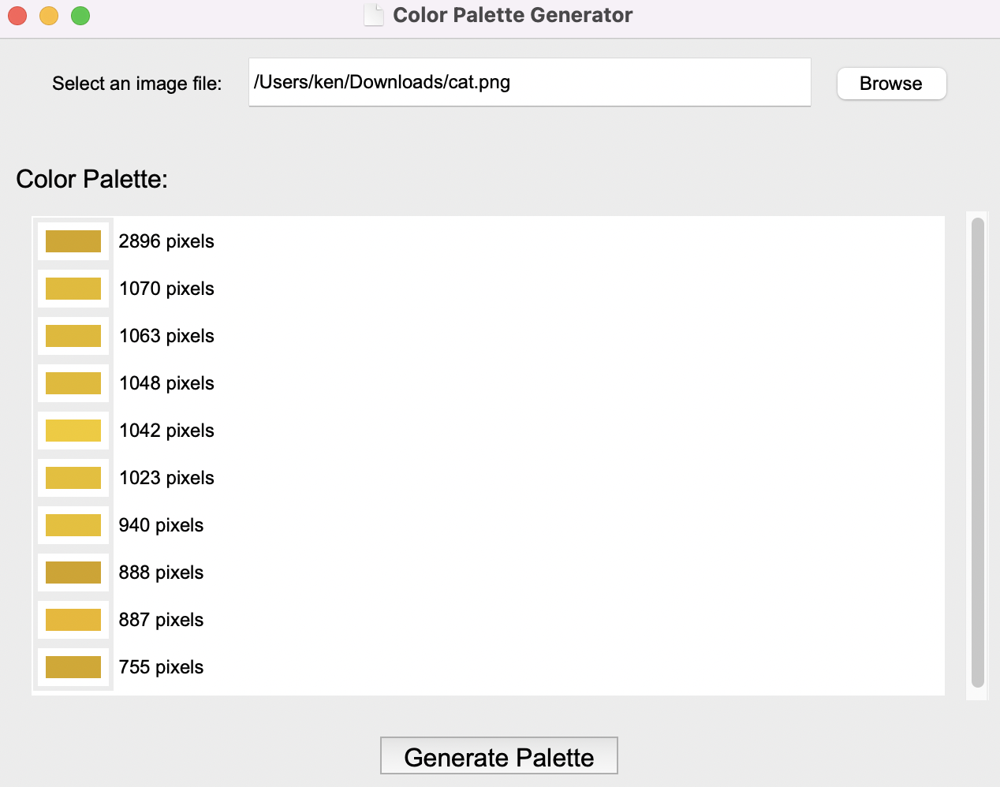

# Image Palette Program
This is a Python program that generates a color palette for an image selected by the user. The program is built using the PIL and tkinter libraries.

## Installation
1. Clone this repository to your local machine.
    ```
    git clone https://github.com/KenAtopos/Python_portfolio_11.git
    ```
## Usage
1. Run the program:
    ```
    python main.py
    ```
2. Click the "Browse" button and select an image file.
3. Click the "Generate Palette" button to generate the color palette for the selected image.
4. The color palette will be displayed in the "Color Palette" section of the window.

